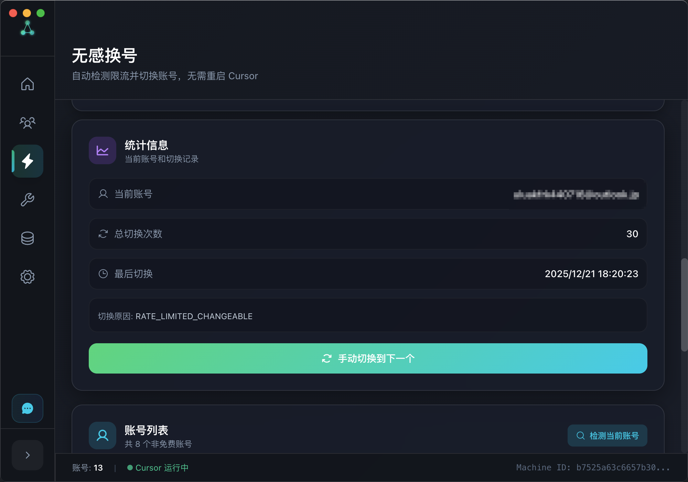
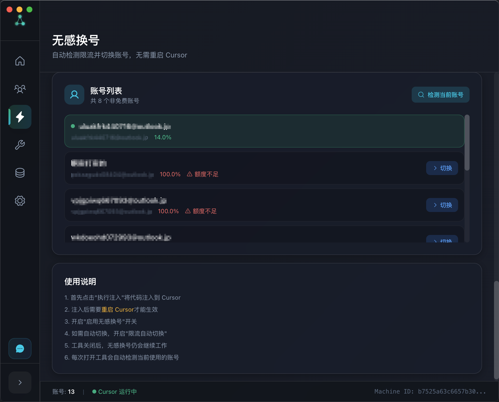
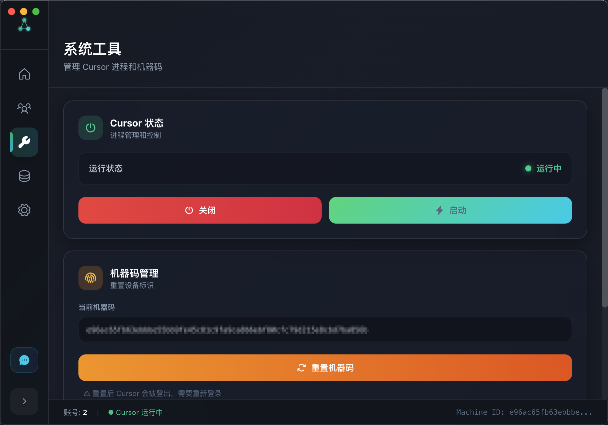
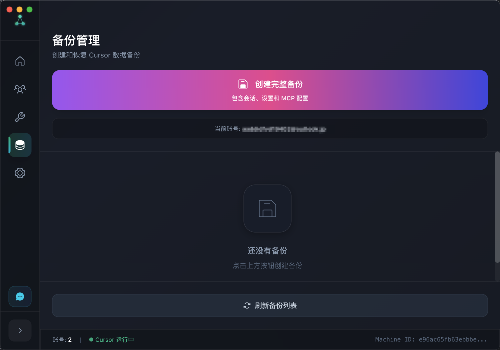
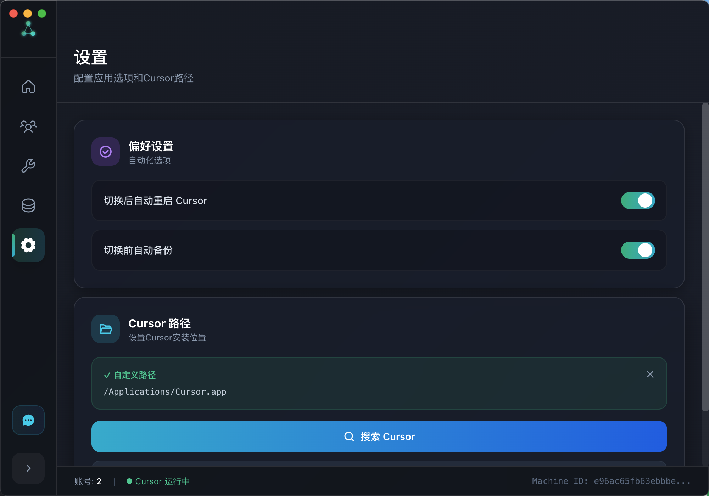

<div align="center">
<h1>🚀 CursorProTools - 专业的 Cursor IDE 增强工具</h1>

<p>
  
  
  
</p>

**让 AI 编程更自由 — 一键管理账户、无感换号、Token 注入、机器码重置**

[📥 立即下载](#-下载安装) · [📖 使用指南](#-使用指南) · [❓ 常见问题](#-常见问题) · [💬 加入群聊](#-交流群组)

</div>

---

## 🎯 为什么选择 CursorProTools？

> **痛点：** Cursor Pro 账号额度有限，频繁达到限制、手动切换账号繁琐、被封禁后束手无策？
>
> **解决方案：** CursorProTools 一站式解决所有问题！

| 😫 传统方式          | ✨ 使用本工具             |
| -------------------- | ------------------------- |
| 手动复制粘贴 Token   | ⚡ 一键注入，秒级切换     |
| 达到限制需手动换号   | 🔄 **无感换号**，自动切换 |
| 切换账号丢失聊天记录 | 💾 完整保留所有会话       |
| 封禁后需重装系统     | 🔥 深度重置，焕然一新     |

---

## ⚡ 核心亮点

<table>
<tr>
<td width="50%">

### 🔄 无感换号

限流时自动切换账号，无需重启 Cursor

- ✅ 检测到 `ERROR_RATE_LIMITED` 自动触发
- ✅ 智能选择有额度的账号
- ✅ 工具关闭后仍持续工作
- ✅ VSCode 风格优雅通知

</td>
<td width="50%">

### ⚡ 秒级账号切换

一键切换多个 Cursor Pro 账号

- ✅ 直接修改认证数据库
- ✅ **会话历史完整保留**
- ✅ 工作区状态不丢失
- ✅ MCP 配置继续生效

</td>
</tr>
<tr>
<td width="50%">

### 🛡️ 多层次机器码重置

从轻量到深度，解决各种封禁问题

- 🔸 **普通重置** - 仅重置机器码
- 🔸 **出厂重置** - 清除所有数据
- 🔥 **深度重置** - 修改系统 UUID + 程序签名

</td>
<td width="50%">

### 💾 数据安全保障

本地存储，隐私无忧

- ✅ 所有数据本地加密存储
- ✅ 零数据上传
- ✅ 操作前自动备份
- ✅ 一键恢复备份

</td>
</tr>
</table>

---

## 📦 下载安装

<div align="center">

|                                   📥 **立即下载最新版本**                                    |
| :------------------------------------------------------------------------------------------: |
| 🎯 **[GitHub Releases - 点击下载](https://github.com/Roshin0320/cursor-pro-tools/releases)** |
|                   **💻 支持平台：Windows 10/11 • macOS (Intel & M 芯片)**                    |

</div>

### 🌟 平台兼容性

| 平台        | 架构                  | 格式                   | 状态    |
| ----------- | --------------------- | ---------------------- | ------- |
| **Windows** | x64                   | `.exe` (安装版/便携版) | ✅ 支持 |
| **macOS**   | Intel / Apple Silicon | `.dmg` / `.zip`        | ✅ 支持 |

### 📋 安装步骤

#### Windows 用户

1. 下载 `CursorProTools Setup x.x.x.exe` (安装版) 或 `CursorProTools x.x.x.exe` (便携版)
2. 双击运行安装程序
3. 如遇到 SmartScreen 警告，点击 "更多信息" → "仍要运行"

#### macOS 用户

1. 下载 `CursorProTools-x.x.x.dmg` 或 `.zip` 文件
2. 打开 DMG 文件，将应用拖入 Applications 文件夹
3. 如提示 "文件已损坏"，请参考 [常见问题](#q-macos-打开应用提示文件已损坏或无法打开)

---

## 🖼️ 界面预览

<div align="center">

### 主界面


### 账号列表 & 添加账号

|                             账号列表                              |                             添加账号                              |
| :---------------------------------------------------------------: | :---------------------------------------------------------------: |
|    |  |
|  |  |

### 无感换号

|                                  无感换号                                  |                                  无感换号                                  |
| :------------------------------------------------------------------------: | :------------------------------------------------------------------------: |
|    |  |
|  |  |

### 工具 & 备份

|                             工具界面                             |                             备份功能                              |
| :--------------------------------------------------------------: | :---------------------------------------------------------------: |
|  |  |

### 设置



</div>

---

## 📖 使用指南

### 1️⃣ 无感换号 — 告别手动切换

<details>
<summary><b>🔍 工作原理（点击展开）</b></summary>

```
用户发送请求
     ↓
Cursor 检测到限流 (ERROR_RATE_LIMITED_CHANGEABLE)
     ↓
注入代码自动拦截
     ↓
调用本地服务获取新账号
     ↓
自动替换 Token
     ↓
显示优雅通知："✓ 已无感换号，请重新提问"
```

</details>

**使用步骤：**

1. 在「无感换号」页面点击 **执行注入**
2. 重启 Cursor
3. 开启 **启用无感换号** 开关
4. 开启 **限流自动切换**（可选）
5. 搞定！Cursor 达到限制时会自动切换账号

---

### 2️⃣ 账号管理 — 高效切换

| 功能              | 说明                             |
| ----------------- | -------------------------------- |
| 🔑 **Token 注入** | 直接修改数据库，无需复制文件     |
| 📥 **一键导入**   | 从当前 Cursor 导入已登录账号     |
| 🔄 **快速切换**   | 选择账号 → 点击切换 → 完成       |
| 💾 **会话保留**   | 聊天记录、设置、MCP 配置全部保留 |

#### 🔑 如何获取 Token？

<details>
<summary><b>方法一：使用本工具导入（推荐）</b></summary>

1. 在 Cursor 中登录账号
2. 在本工具中点击 **"导入当前账号"**
3. 自动获取当前登录账号的 Token

</details>

<details>
<summary><b>方法二：手动提取</b></summary>

**Mac 系统：**

```bash
sqlite3 "~/Library/Application Support/Cursor/User/globalStorage/state.vscdb" \
  "SELECT value FROM ItemTable WHERE key='cursorAuth/accessToken'"
```

**Windows 系统：**

```cmd
sqlite3 "%APPDATA%\Cursor\User\globalStorage\state.vscdb" \
  "SELECT value FROM ItemTable WHERE key='cursorAuth/accessToken'"
```

</details>

---

### 3️⃣ 机器码重置 — 解除封禁

| 重置级别     | 适用场景     | 风险等级 |
| ------------ | ------------ | -------- |
| **普通重置** | 日常切换账号 | 🟢 低    |
| **出厂重置** | 轻度封禁     | 🟡 中    |
| **深度重置** | 严重封禁     | 🔴 高    |

**深度重置包含：**

<details>
<summary><b>macOS 系统</b></summary>

- 修改系统 UUID
- 清除 DNS 缓存
- 修改 Cursor 程序文件
- 移除并重新签名应用

</details>

<details>
<summary><b>Windows 系统（需管理员权限）</b></summary>

- 修改注册表 MachineGuid
- 修改系统标识符
- 清除 DNS/ARP/NetBIOS 缓存
- 处理 MAC 地址信息
- 清除 Windows 事件日志
- 清除缓存和临时文件
- 修改 Cursor 程序文件（8 种匹配模式）

</details>

> ⚠️ **重要提示**：
>
> - Windows 需要以 **管理员身份** 运行才能完整执行深度重置
> - Mac 上首次启动修改后的 Cursor 可能需要在 "系统偏好设置 → 安全性" 中允许
> - 建议深度重置后重启计算机

---

### 4️⃣ 备份恢复 — 数据无忧

| 备份类型     | 包含内容                       |
| ------------ | ------------------------------ |
| **会话备份** | 聊天历史、工作区状态、项目配置 |
| **设置备份** | 编辑器设置、快捷键、代码片段   |

---

## ❓ 常见问题

### Q: macOS 打开应用提示"文件已损坏"或"无法打开"？

这是因为应用未经 Apple 签名，macOS Gatekeeper 会阻止运行。

<details>
<summary><b>🔧 解决方案（点击展开）</b></summary>

**方法一：终端命令（推荐）**

```bash
# 移除隔离属性
xattr -cr /Applications/CursorProTools.app

# 如果上面命令无效，使用 sudo
sudo xattr -rd com.apple.quarantine /Applications/CursorProTools.app
```

**方法二：右键打开**

1. 右键点击应用
2. 选择 "打开"
3. 在弹出对话框中点击 "打开"

**方法三：系统设置**

1. 打开 "系统设置" → "隐私与安全性"
2. 滚动到底部，找到被阻止的应用
3. 点击 "仍要打开"

</details>

---

### Q: 切换账号后 Cursor 无法启动？

<details>
<summary><b>🔧 解决方案</b></summary>

1. 确保在切换前完全关闭了 Cursor
2. 手动强制关闭 Cursor 进程：
   - **Windows**：任务管理器 → 结束 Cursor 进程
   - **Mac**：活动监视器 → 强制退出 Cursor
3. 等待 3-5 秒后再启动

</details>

---

### Q: Token 失效怎么办？

<details>
<summary><b>🔧 解决方案</b></summary>

1. 在 Cursor 中重新登录该账号
2. 使用 **"导入当前账号"** 功能更新 Token

</details>

---

### Q: 重置机器码后仍然被限制？

<details>
<summary><b>🔧 解决方案</b></summary>

1. 尝试执行 **"深度重置"**
2. 重启计算机
3. 等待一段时间后再尝试

</details>

---

### Q: Windows 系统中，Cursor 路径应该填写什么？

<details>
<summary><b>🔧 解决方案</b></summary>

应该填写 **Cursor 的文件夹路径**，而不是 exe 文件路径。

**✅ 正确示例：**

- `C:\Users\你的用户名\AppData\Local\Programs\Cursor`
- `C:\Program Files\Cursor`

**❌ 错误示例：**

- `C:\Users\你的用户名\AppData\Local\Programs\Cursor\Cursor.exe`

</details>

---

### Q: 备份的数据存储在哪里？

<details>
<summary><b>📂 数据存储位置</b></summary>

| 平台        | 路径                                              |
| ----------- | ------------------------------------------------- |
| **macOS**   | `~/Library/Application Support/cursor-pro-tools/` |
| **Windows** | `%APPDATA%\cursor-pro-tools\`                     |

</details>

---

## 🔒 安全说明

| 特性            | 说明                          |
| --------------- | ----------------------------- |
| ✅ **本地存储** | SQLite 数据库，数据不离开本机 |
| ✅ **零上传**   | 不会上传任何数据到远程服务器  |
| ✅ **自动备份** | 高风险操作前自动创建备份      |
| ✅ **可恢复**   | 所有修改都可一键恢复          |

---

## 💬 交流群组

<div align="center">

|              💬 **QQ 交流群：[872329220]**              |
| :-----------------------------------------------------: |
| 🎯 **使用教程和问题解答 • 版本更新通知 • 用户经验交流** |


</div>

**群内福利：**

- 📢 第一时间获取新版本
- 💡 技术问题快速解答
- 🎁 不定期分享账号资源

---

## ☕ 赞助支持

如果这个项目对你有帮助，欢迎赞助支持持续开发！

<div align="center">

|                      微信赞助                       |                       支付宝赞助                        |
| :-------------------------------------------------: | :-----------------------------------------------------: |
|  微信收款码 |  支付宝收款码 |

</div>

---

## 📋 更新日志

### v0.2.0 (最新)

- 🆕 **无感换号功能** — 限流自动切换账号
- 🆕 本地服务支持，工具关闭后仍可使用
- 🆕 账号额度检测
- ✨ 优化界面交互

---

## ⚖️ 免责声明

> ⚠️ **重要声明**
>
> 本工具 **仅供学习和研究使用**，使用本工具所产生的任何后果由使用者自行承担。
>
> - 请遵守 Cursor 的服务条款
> - 频繁切换账号可能违反服务协议
> - 本工具不收集或上传任何用户数据

---

<div align="center">

**⭐ 如果觉得好用，请给个 Star 支持一下！**

<br>

Made with ❤️ by **Roshin**

<sub>让 AI 编程更自由 🚀</sub>

</div>
